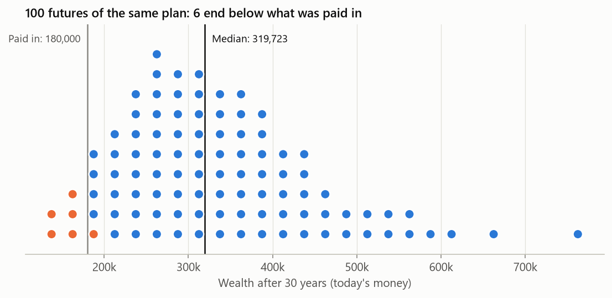
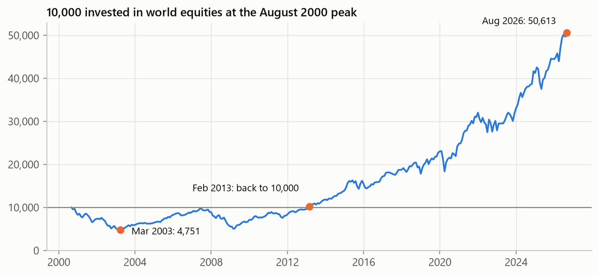
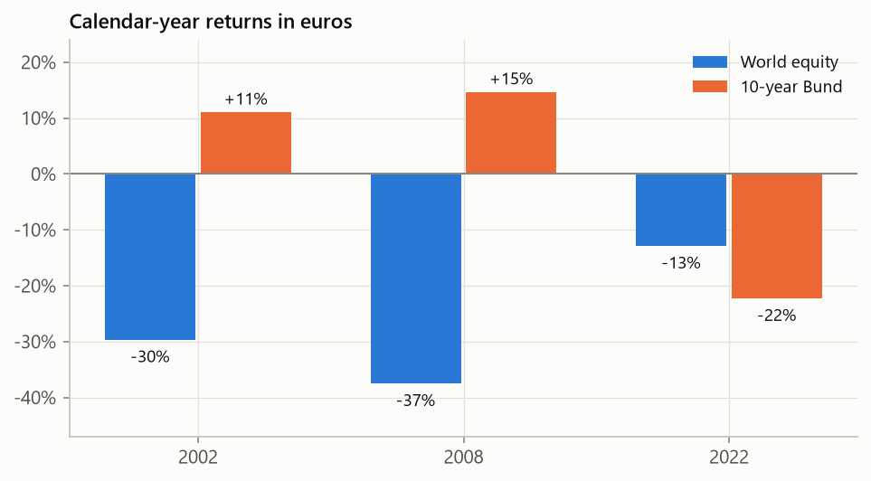
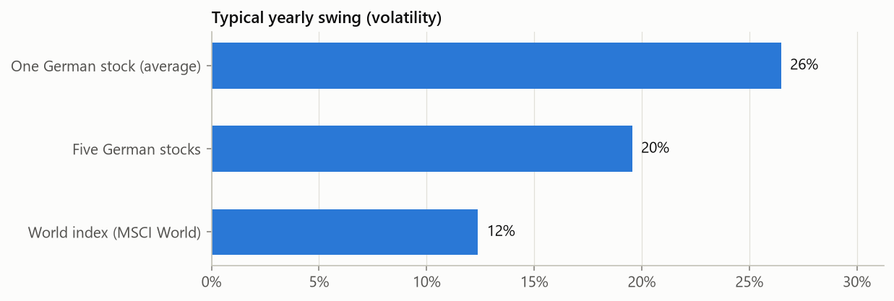
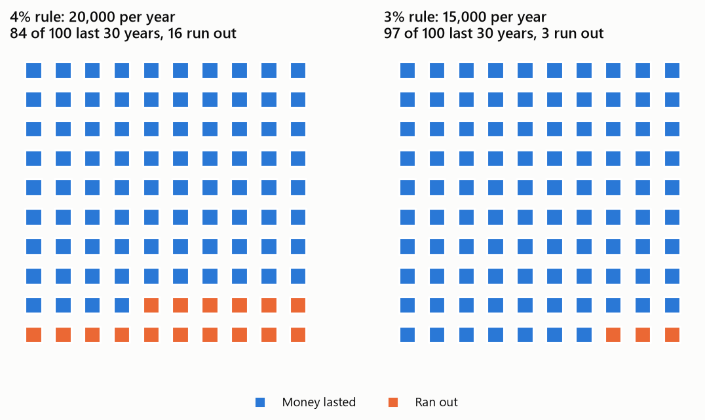

# investor-toolkit

[](https://github.com/alejandroperretg/investor-toolkit/actions/workflows/ci.yml)

A Python toolkit that answers six questions long-term investors ask, using euro-area market data
from 1999 to 2026. Every model is first tested on cases with a known answer, the way simulation
software is validated, before it is applied to questions without one.

> Not investment or tax advice. The results describe one historical period and the stated
> assumptions. Market data run to August 2026 (index data) and September 2026 (ETFs).

## Results at a glance

Amounts are in today's money, corrected for inflation, unless marked otherwise. Each result is
derived step by step in the [notebooks](notebooks); [notebook 0](notebooks/00_at_a_glance.ipynb)
reproduces this section.

### 1. A savings plan is a range, not a number

Save €500 a month for 30 years in a portfolio of 60% world stocks and 40% German government bonds,
with the monthly amount rising with inflation: €180,000 paid in. After fund costs and German tax,
including the tax on the final sale, the middle outcome is **€289,000, 1.6 times the money paid
in**. Of 100 simulated futures, the worst ends with €129,000, the best with €645,000, and **7 end
below the amount paid in**.



### 2. Crashes are deep, and recovery can take more than a decade

€10,000 invested in world stocks at the August 2000 peak fell to **€4,751 by March 2003**. On the
account statement it was back to €10,000 in February 2013; after inflation, only in **August
2014**. By 2026 it had grown to €50,600, or €28,800 in today's money. Anyone forced to sell in 2003
lost half; anyone who could wait was rewarded.



### 3. Extreme days are far more common than a bell curve predicts

Daily moves of the MSCI World ETF since 2010, compared with a normal (bell-curve) distribution:

| Move larger than | Days it happened (17 years) | Bell curve: once every |
|---|---|---|
| 3 typical days (3 sigma) | 72 | 1.5 years |
| 4 typical days (4 sigma) | 24 | 63 years |
| 5 typical days (5 sigma) | 10 | 7,000 years |

Part of the excess comes from volatility clustering, the alternation of calm and turbulent
periods. Measured against the volatility of the preceding weeks, 4 of the 10 extreme days remain,
still more than a thousand times what the bell curve allows. In an out-of-sample test, a loss
limit that a bell-curve model expected to be crossed in 1 month out of 100 was crossed in 3.7.

### 4. In this sample, bonds cushioned recessions but not inflation

In 2002 and 2008, German government bonds **gained while world stocks lost 30% and 37%**. In 2022
**both fell**, stocks by 13% and bonds by 22%: rising inflation pushed interest rates up, and
rising rates lower bond prices. Three years illustrate the pattern; they do not prove a law.



### 5. Diversification works when the holdings are different

A single German blue-chip stock typically swings about 26% in a year. Five of them together swing
about 20%, because the companies share one economy. The world index swings about 12%.



### 6. A 4% withdrawal rate was risky with euro-area returns

Retire with €500,000 in the 60/40 portfolio and withdraw a fixed amount each year, raised with
inflation. Over 30 years, **€20,000 a year (4%) ran out of money in 16 of 100 histories; €15,000
a year (3%) in 3 of 100.**



### 7. All of these numbers depend on one history

The simulations reuse the 27 years since 1999, which contain only a few bear markets. With **1
percentage point less return a year**, the median savings result falls from €289,000 to
**€248,000** and the 4% rule lasts in **71 instead of 84** histories out of 100. Treat the numbers
as one plausible scenario, not a forecast.

### 8. A good backtest is not proof of skill

A simple trend-following rule turned €1 into €8.0 since 2002, against €6.8 for buying and holding,
and its worst fall was 20% instead of 48%. Resampling the history 2,000 times, it came out behind
in about 9 cases out of 100, too often to rule out luck. The backtest also ignores taxes: the rule
trades about three times the portfolio's value each year, and in a taxable account every sale
realises gains.

### Terms

| Term | Meaning |
|---|---|
| Volatility | The typical yearly swing. At 12%, the return lands within 12 points of its average in about two years out of three. |
| Drawdown | The fall from the previous high. €10,000 falling to €4,750 is a 52% drawdown. |
| Correlation | Whether two assets move together: +1 always together, 0 unrelated, -1 always opposite. |
| Sigma | The typical size of a move. A 5-sigma day is five times larger than a typical day. |
| Monte Carlo | Simulating thousands of possible market histories to see the range of outcomes. |
| Today's money | Amounts corrected for inflation, so that €100 buys what €100 buys today. |

## How the models are checked

A structural solver is trusted only after it reproduces the textbook deflection of a simple beam.
The same rule applies here: each model must first reproduce a case with a known answer.

| Check | Known answer | Toolkit |
|---|---|---|
| Mean final wealth of a savings plan under geometric Brownian motion | €51,041 | €50,993 |
| Simulation error with four times more histories | halves (slope -0.50) | slope -0.49 |
| Expected maximum drawdown of Brownian motion, √(π/2) | 1.253 | 1.247 |
| Lifetime fund tax (no allowance, tax paid from outside the portfolio) | flat tax on the total gain | equal to 10 digits |
| Ledoit-Wolf shrinkage; OLS, White and Newey-West standard errors | scikit-learn, statsmodels | equal to 8-10 digits |
| Synthetic Bund vs broad German government bond ETF | correlation near 1 | 0.95 |


The full list is in [notebook 8](notebooks/08_validation.ipynb). All checks run in CI on every push.

## Modules

| Module | Question | Notebook |
|---|---|---|
| | The results as euro examples | [00 At a glance](notebooks/00_at_a_glance.ipynb) |
| `data`, `proxies` | Where do the numbers come from, and what happened before ETFs existed? | [01 Data](notebooks/01_data.ipynb) |
| `returns` | What do returns look like? | [02 Returns](notebooks/02_returns.ipynb) |
| `risk` | How bad can it get, and for how long? | [03 Risk](notebooks/03_risk.ipynb) |
| `diversification` | Does combining assets reduce risk, and by how much? | [04 Diversification](notebooks/04_diversification.ipynb) |
| `factors` | What drives an asset's returns? | [05 Factors](notebooks/05_factors.ipynb) |
| `backtest` | Would a strategy have worked, or was it luck? | [06 Backtest](notebooks/06_backtest.ipynb) |
| `montecarlo`, `tax` | What will a savings plan reach, and how much can a retiree withdraw? | [07 Monte Carlo](notebooks/07_montecarlo.ipynb) |
| | How do we know the models are right? | [08 Validation](notebooks/08_validation.ipynb) |

## Quick start

Requires [uv](https://docs.astral.sh/uv/).

```
git clone https://github.com/alejandroperretg/investor-toolkit.git
cd investor-toolkit
uv sync
uv run pytest                  # offline unit and validation tests
uv run pytest -m network       # tests that download market data
```

Project a savings plan from resampled history:

```python
from investor_toolkit import montecarlo as mc
from investor_toolkit import proxies
from investor_toolkit.tax import GermanTax, blended_partial_exemption

history = proxies.long_history()  # downloads and caches the data on first use
balanced = 0.6 * history["world_equity"] + 0.4 * history["bund_10y"]
model = mc.Bootstrap(balanced, history["inflation"], mean_block=12)
plan = mc.SavingsPlan(
    monthly_contribution=500,
    accumulation_years=30,
    annual_fee=0.002,
    tax=GermanTax(partial_exemption=blended_partial_exemption(0.6)),
)
result = mc.simulate(model, plan, n_paths=10_000)
print(result.summary())
print(result.percentiles())  # wealth percentiles per year, in today's money
```

To run the notebooks, open them in VS Code (or any Jupyter front end) and select the project's
`.venv` as the kernel.

## Data

| Source | Series |
|---|---|
| [Yahoo Finance](https://finance.yahoo.com) via `yfinance` | Xetra-listed UCITS ETFs and stocks (total-return prices) |
| [FRED](https://fred.stlouisfed.org) | USD/EUR exchange rate (`DEXUSEU`), German 3-month rate, euro-area HICP |
| [Deutsche Bundesbank](https://www.bundesbank.de/en/statistics) | Daily 10-year German government yield |
| [Kenneth R. French Data Library](https://mba.tuck.dartmouth.edu/pages/faculty/ken.french/data_library.html) | Developed and European factor returns |

European ETFs exist only from about 2009. Earlier history is rebuilt from official index data
and checked against the ETFs where both exist ([notebook 1](notebooks/01_data.ipynb)). Data are
downloaded on first use and cached in `data/`, which is not part of the repository.

## Project layout

```
src/investor_toolkit/
    data.py             cached loaders, currency conversion, quality checks
    proxies.py          long-history EUR series (equity, synthetic Bund, cash, inflation)
    universe.py         assets and model portfolios
    returns.py          return conventions, distribution fits, tails, variance ratios
    risk.py             VaR/ES, VaR backtests, drawdowns, risk-adjusted ratios
    diversification.py  covariance shrinkage, frontier, risk parity, conditional correlation
    factors.py          Fama-French regressions with robust standard errors
    backtest.py         look-ahead-free engine, strategies, deflated Sharpe ratio
    resampling.py       stationary block bootstrap
    montecarlo.py       savings and withdrawal simulation
    tax.py              German investment-fund taxation
    plotting.py         figure style
tests/                  unit and validation tests
notebooks/              worked examples; they generate docs/figures
scripts/site_charts.py  charts for the project page on alejandroperretg.github.io
docs/methodology.md     equations, assumptions, limitations, references
```

## Methodology and limitations

Equations, assumptions and references are in [docs/methodology.md](docs/methodology.md). Its
limitations section matters most: one 27-year history, a simplified tax model, pre-tax backtests
and risk models that do not forecast volatility.

Project page: [alejandroperretg.github.io/projects/investor-toolkit](https://alejandroperretg.github.io/projects/investor-toolkit/)

## License

[MIT](LICENSE)
