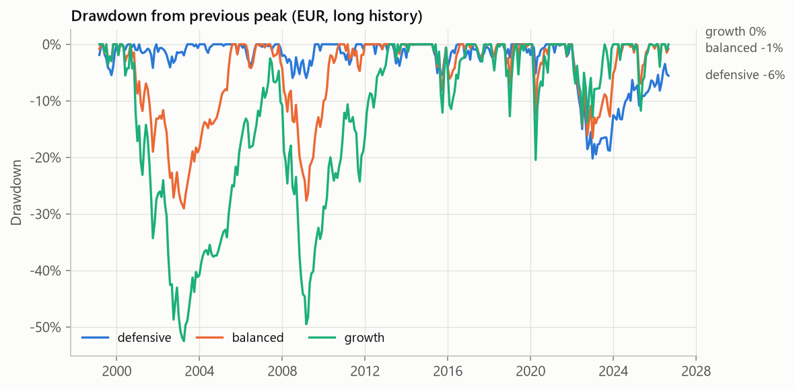
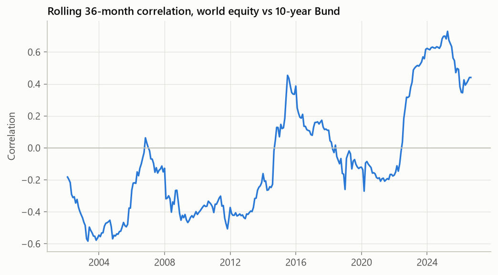
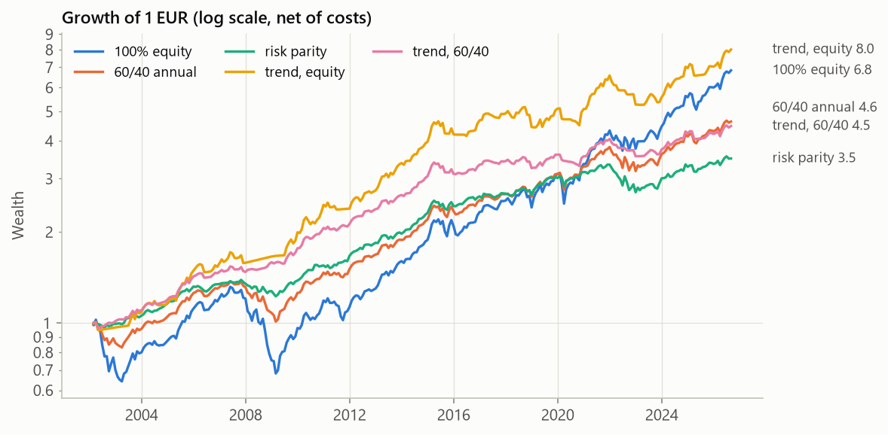
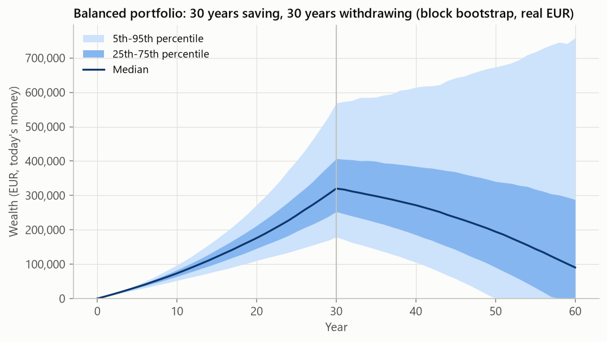
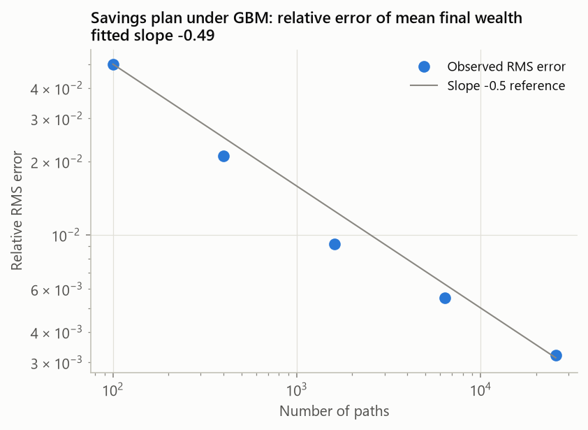

# investor-toolkit

[](https://github.com/aperret04/investor-toolkit/actions/workflows/ci.yml)

Quantitative tools for long-term investors in EUR, built and tested like engineering simulation
software: every model is verified against an analytical solution, an exact identity or an
established reference implementation.

Each module answers one question an investor actually has:

| Module | Question | Notebook |
|---|---|---|
| `data`, `proxies` | Where do the numbers come from, and what happened before ETFs existed? | [01 Data](notebooks/01_data.ipynb) |
| `returns` | What do returns look like? | [02 Returns](notebooks/02_returns.ipynb) |
| `risk` | How bad can it get, and for how long? | [03 Risk](notebooks/03_risk.ipynb) |
| `diversification` | Does combining assets reduce risk, and by how much? | [04 Diversification](notebooks/04_diversification.ipynb) |
| `factors` | What drives an asset's returns? | [05 Factors](notebooks/05_factors.ipynb) |
| `backtest` | Would a strategy have worked, or was it luck? | [06 Backtest](notebooks/06_backtest.ipynb) |
| `montecarlo`, `tax` | What range of outcomes can a savings plan expect, and how much can be withdrawn? | [07 Monte Carlo](notebooks/07_montecarlo.ipynb) |
| | How do we know the models are right? | [08 Validation](notebooks/08_validation.ipynb) |

> Not investment or tax advice. Results describe historical data and model assumptions.

## Selected findings

All figures use EUR returns. The long history (from 1999) combines official index data where
ETFs did not yet exist; see [notebook 1](notebooks/01_data.ipynb) for how the proxies are built
and validated against real ETFs.

**The ETF era understates risk.** Since 2010 the largest month-end drawdown of a world-equity
ETF was about 19 %. Over the longer history the same exposure lost 52 % from the 2000 peak and
took over 12 years to recover in nominal terms.



**The stock-bond hedge is not a constant.** For two decades German government bonds were
negatively correlated with equities. Since the 2022 inflation shock the correlation has been
clearly positive, which changes the risk of every balanced portfolio.



**Normal-distribution risk models fail in the tail.** In a rolling out-of-sample test, the
Gaussian 99 % monthly VaR was breached in 3.7 % of months instead of 1 % (Kupiec p < 0.001).
And a 60/40 portfolio is balanced in capital, not in risk: in the ETF era about 88 % of its
volatility came from the equity part.

**Backtests need error bars.** Trend following had the highest Sharpe ratio of nine strategies
tested since 2002, but a paired block-bootstrap confidence interval for the improvement still
includes zero. Lump-sum investing beat 12-month dollar-cost averaging in about two out of three
start months.



**Savings projections.** Saving 500 EUR per month for 30 years in a 60/40 portfolio, with costs
and German taxes, gives a median of about 320,000 EUR in today's money, with a 5-95 % range of
roughly 180,000 to 570,000 EUR (block bootstrap of history). The initial withdrawal rate that
lasted 30 years in 95 % of scenarios was between 2.7 % and 3.2 % depending on the allocation;
the popular 4 % rule fell well short.



## Verification and validation

The models are tested the way a simulation code would be: against closed-form solutions,
conservation-type identities and reference implementations, including convergence behaviour.
Some examples:

| Check | Reference |
|---|---|
| Monte Carlo error falls as $N^{-1/2}$; simulated wealth matches exact mean and variance under GBM | Closed form |
| Simulated maximum drawdown of Brownian motion converges to $\sqrt{\pi/2}\,\sigma\sqrt{T}$ after a discrete-monitoring correction | Magdon-Ismail et al. (2004), Broadie et al. (1997) |
| Lifetime German fund tax equals the flat tax on the total gain (the annual Vorabpauschale is a prepayment) | Exact identity |
| Ledoit-Wolf shrinkage, OLS, White and Newey-West standard errors | scikit-learn, statsmodels |
| Newey-West intervals reach nominal coverage with autocorrelated data; classical intervals do not | Simulation |
| Expected maximum Sharpe ratio of worthless strategies; Sharpe ratio standard error | Bailey and Lopez de Prado (2014), Lo (2002) |
| Synthetic Bund returns track German government bond ETFs; the betas order by duration | Market data |



The full inventory is in [notebook 8](notebooks/08_validation.ipynb); all checks run in CI.

## Quick start

Requires [uv](https://docs.astral.sh/uv/).

```
git clone https://github.com/aperret04/investor-toolkit.git
cd investor-toolkit
uv sync
uv run pytest                  # offline unit and validation tests
uv run pytest -m network       # tests that download market data
```

Project a savings plan from bootstrapped history:

```python
from investor_toolkit import montecarlo as mc
from investor_toolkit import proxies
from investor_toolkit.tax import MIXED_FUND, GermanTax

history = proxies.long_history()  # downloads and caches the data on first use
balanced = 0.6 * history["world_equity"] + 0.4 * history["bund_10y"]
model = mc.Bootstrap(balanced, history["inflation"], mean_block=12)
plan = mc.SavingsPlan(
    monthly_contribution=500,
    accumulation_years=30,
    annual_fee=0.002,
    tax=GermanTax(partial_exemption=MIXED_FUND),
)
result = mc.simulate(model, plan, n_paths=10_000)
print(result.summary())
print(result.percentiles())  # wealth percentiles per year, in today's money
```

To run the notebooks, open them in VS Code (or any Jupyter front end) and select the project's
`.venv` as the kernel.

## Data

| Source | Series |
|---|---|
| [Yahoo Finance](https://finance.yahoo.com) via `yfinance` | Xetra-listed UCITS ETFs and stocks (total-return prices) |
| [FRED](https://fred.stlouisfed.org) | USD/EUR (`DEXUSEU`), German 3-month rate, euro-area HICP |
| [Deutsche Bundesbank](https://www.bundesbank.de/en/statistics) | Daily 10-year German government yield |
| [Kenneth R. French Data Library](https://mba.tuck.dartmouth.edu/pages/faculty/ken.french/data_library.html) | Developed and European factor returns |

Data are downloaded on first use and cached in `data/` (not part of the repository).

## Project layout

```
src/investor_toolkit/
    data.py             cached loaders, currency conversion, quality checks
    proxies.py          long-history EUR series (equity, synthetic Bund, cash, inflation)
    universe.py         assets and model portfolios
    returns.py          return conventions, distribution fits, tails, variance ratios
    risk.py             VaR/ES, VaR backtests, drawdowns, risk-adjusted ratios
    diversification.py  covariance shrinkage, frontier, risk parity, conditional correlation
    factors.py          Fama-French regressions with robust standard errors
    backtest.py         look-ahead-free engine, strategies, deflated Sharpe ratio
    resampling.py       stationary block bootstrap
    montecarlo.py       savings and withdrawal simulation
    tax.py              German investment-fund taxation
    plotting.py         figure style
tests/                  unit and validation tests
notebooks/              worked examples (generate docs/figures)
docs/methodology.md     equations, assumptions, limitations, references
```

## Methodology and limitations

Equations, conventions, assumptions and references are in
[docs/methodology.md](docs/methodology.md). The main limitation is sample length: about 27 years
of monthly data contain only a few independent bear markets, so long-horizon statistics carry wide
uncertainty. The tax model is a planning simplification.

## License

[MIT](LICENSE)
